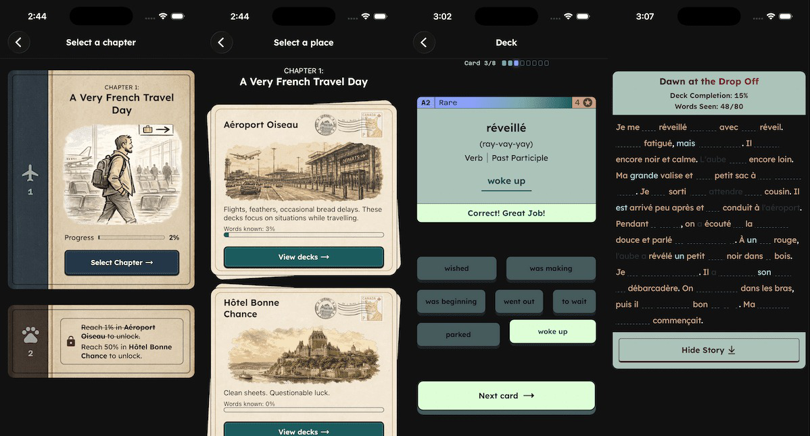

# Allô Carto

## Dev Notes

- May 15, 2026 | Started rebuilding in React Native. I preserved the flutter version under branch `v1-flutter`.
- June 30, 2026 | Merged the first story into the app. This shifts the application from being a "flashcard" app into something much more progression based, which will be much more fun and useful. im really pretty stoked about how it is turning out!

Pronunciations aren't official, they're just kinda like this:

- `an` / `en`: `ahn`
- `on`: `ohn`
- `in` / `ain` / `ein`: `an`
- `un`: `uhn`

The final `n` usually means do the french nasal sound but idk, it's confusing so we include it a lot anyway.

## Style Guide

### Colors

#### Dark

- Primary : `#1C5B5E`

- Secondary : `#762D3D`

- Text : `#121212`

- Background : `#131A1B`

- Border : `#1B2B31`

- Secondary Border : `#382326`

#### Light

- Primary: `#7BADA6`

- Secondary: `#E09FAD`

- Text: `#F7F7F7`

- Background: `#8CABA0`

- Border: `#465B5D`

- Secondary Border: `#6B474B`

### Alerts

#### Dark

- Success: #032B1C

- Warning: #332105

- Danger: #3E0E14

#### Light

- Success: #DDFFD6

- Warning: #FFC670

- Danger: #FF7081

### Fonts

**Lexend** is used throughout the application, with **Azeret Mono** for compact rank/CEFR labels. Static font weights live in `app/assets/fonts/` and are loaded asynchronously via the `useFonts` hook in Expo.

https://blog.logrocket.com/how-to-add-custom-fonts-react-native/

## Roadmap

- DB sqlite? Nous besoin quelque chose sur le frontend. Ce sera cree avec decks premiere et les words apre.
- Rarate et styles des cartes. Les cartes plus rares ont des styles plus cool.
- Idea pour deck du rare, quand un personne besoin mots nouveaux, cest bonne pour mots le personne ne trouve pa

## TODO

- App icon and cleaning out the images dir
- Deck progress (progress bar, count, etc.)
- Rank indicator while doing a deck
- accessibility roles
- SVG chapter and progress map (visual and data)
- Place hero image frame (like a polaroid or something? Idk)
- Deck count on place selection view
- Word count per day/history feature along with words learned per day delta
- You should probably get rid of the undraw SVG on the "Learn more words!" card
- Card Collection page
- Fix portrait orientation (landscape should be disabled)
- Add "repeat deck" on the results view
- Mailing link on cards to email me with bad translations
- Completion steps (Results -> Experience gain + coins -> )
- Look into how to use the dynamic island
- fix the min amount problem for reverse dir cards (fnew has 4 left)

## Free art and assets credits

### Placeholder images

- [unDraw](https://undraw.co/)
- [Fabnel LDN — Vibrant aisle in supermarket with drinks display (Pexels)](https://www.pexels.com/photo/vibrant-aisle-in-supermarket-with-drinks-display-33690927/) — Temporary artwork for the Grocery Store deck.
- [Dawn drop off](https://unsplash.com/photos/cars-on-a-road-vxaTycfb78w?utm_source=unsplash&utm_medium=referral&utm_content=creditShareLink)
- [Trouble in the terminal](https://unsplash.com/photos/building-interior-photograph-l5fDJ3I-9Uk?utm_source=unsplash&utm_medium=referral&utm_content=creditShareLink)
- [To the gate](https://www.pexels.com/photo/airbus-at-airport-16562841/)
- [Elevator epics](https://www.pexels.com/photo/hand-picking-the-floor-in-the-elevator-16026071/)

"Blaming on his boots the faults of his feet" - Vlad
